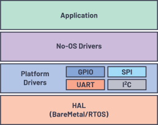
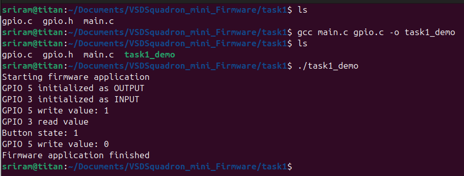

## Task 1
### What is Firmware?
A firmware is a specific kind of software that is specially written for a particular hardware, which acts as the crucial link between the hardware and the higher level program, thus providing the user control over the hardware using a programming language like C, C++ and Python.

In the example code given it contains 2 program files:
1. The firmware that controls hardware : ```gpio.c```
2. The header file to make the firmware resuable: ```gpio.h```
3. And, the main program which controls the hardware under certain conditions: ```main.c```

<center>
  
</center>

**Example**: 
The ```gpio.c``` is the hardware specific fimware which controls the peripehrals like the GPIO in the MCU and are seperated into different function for each of its fucntionalities like GPIO direction, read and write functions.
```c
void gpio_init(int pin, int direction){
    .....
}

void gpio_write(int pin, int value){
    .....
}

int gpio_read(int pin){
    .....
}
```

## What is API?
An **API (Application Programming Interface)** is like a set of rules, protocols, and tools that lets different software applications talk to each other. 

So it allows developers to use existing functionalities without knowing the internal code, it like the **HAL Libraries** in STM32 and **C++ Libraries** like digitalWrte() and digitalRead() in Arduino. 

So the API in example code are in the ```gpio.h``` file:
```c
void gpio_init(int pin, int direction);
void gpio_write(int pin, int value);
int  gpio_read(int pin);
```

They are the API functions that embedded developers users keeping resuing throughout the hardware programming.

### How API's are used in the main program?
This is the ```main.c``` program file which utilize the API functions created in the ```gpio.c``` firmware file.

```c
#include <stdio.h>
#include "gpio.h"

#define LED_PIN 5
#define BTN_PIN 3

int main(void)
{
    printf("Starting firmware application\n");

    gpio_init(LED_PIN, GPIO_OUTPUT);
    gpio_init(BTN_PIN, GPIO_INPUT);

    gpio_write(LED_PIN, 1);

    int button_state = gpio_read(BTN_PIN);
    printf("Button state: %d\n", button_state);

    gpio_write(LED_PIN, 0);

    printf("Firmware application finished\n");

    return 0;
}
```

## Importance of API
1. Hardware Abstraction & Portability
2. Code reusability
3. Parallel & Modular Development
4. System Safety & Stability
5. Simplified Maintenance

## Conclusion from Task 1 Lab
1. This lab shows that I can model how a chip works using a computer program; instead of actual electricity, we use text output to see if our "hardware" is responding correctly.

2. By splitting the code, I learned how to keep the "instructions" separate from the "work." The main program just gives orders without needing to understand the complicated math or logic behind them.

3. The header file acts like a shared rulebook. It ensures that both the user and the system are using the same names and settings, so there are no misunderstandings when the code runs.

4. I practiced the basic steps of controlling any electronic pin: first tell the pin which way to move data (setup), and then it either send information out or pull information in.

5. Using three different files showed me how professional engineers stay organized. It makes the code much easier to read and allows one person to fix the hardware logic without breaking the main application.

6. The project helped me see that firmware is really just a "translator." It takes a simple human command like "Write" and turns it into the specific steps the machine needs to follow.

## Task 1 Output Screenshot

<center>
  
</center>
