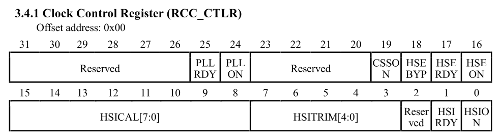
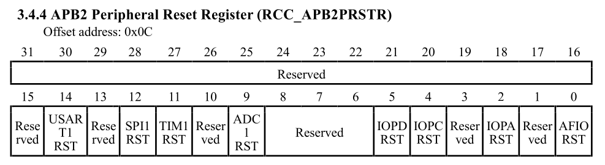

## Task 2
### Overview
The objective of this task is to validate the VSDSquadron Mini RISC-V board by implementing a custom firmware layer. 

### Step 1: Clock Source Selection
For this we will default to the use of external cystal oscillator (24MHz). The procedure and the bits to enable the HSE (High Speed External) clock source are found in the ```RCC_CTRL``` register. The screenshot below shows the ```RCC_CTRL``` register:

<center>
  
</center>

The C program to enable the HSE clock source is as follows:
```c
#include "hse_init.h"

void HSE_Init(void) {
    RCC->CTLR |= RCC_HSEON;
    while(!(RCC->CTLR & RCC_HSERDY));
    RCC->CFGR0 &= ~RCC_HPRE;
    RCC->CFGR0 &= ~RCC_SW;
    RCC->CFGR0 |= RCC_SW_HSE;
    while ((RCC->CFGR0 & RCC_SWS) != RCC_SWS_HSE);
    SystemCoreClockUpdate();
}
```
This is done by first enabling the HSEON bit in the register and then waiting for the HSERDY bit become 1 which indiates that the clock is stable to feed to the system.

### Step 2: Feed the HSE Clock to Peripehral Bus
Next step is to feed the clock source into the peripheral bus so that the peripherals get the clock to function properly. This is done by configuring the AHB Prescaler in the ```RCC_CFGR0``` register.

By default, the system might divide the clock to save power. To ensure the UART and GPIO run at the full 24MHz speed of the crystal, we must set the prescaler to no division (Prescaler = 1).

Additionally, even with the bus running, each specific peripheral (like Port D or UART1) is "gated" (turned off) by default. We must explicitly enable them using the ```RCC_APB2PCENR``` register.

<center>
  
</center>

<center>
  
</center>

### Step 3: GPIO & UART Driver Implementation
The firmware interacts with the hardware through two custom drivers: ```gpio.c``` and ```uart.c```. These drivers handle the low-level register manipulation, ensuring the clock is active and the pins are correctly multiplexed.

#### 1. UART Driver 
The Serial_Begin function performs the complete initialization sequence for serial communication.

Feeding the Clock (The "Power Switch") Before configuring any registers, we must enable the clock for the UART peripheral and the GPIO Port D (where the UART pins live).

```c
RCC->APB2PCENR |= RCC_APB2Periph_USART1 | RCC_APB2Periph_GPIOD;
```

- RCC_APB2Periph_USART1: Feeds the 24MHz clock to the UART1 block so it can generate baud rates.
- RCC_APB2Periph_GPIOD: Feeds the clock to Port D so the TX/RX pins can function.

#### 2. GPIO Driver 
The GPIO driver abstracts pin control into pinMode and digitalWrite.

Thus the firmware to control the gpio and uart are written into 2 different file named as ```uart.c``` and ```gpio.c``` with its specific header file.

## 