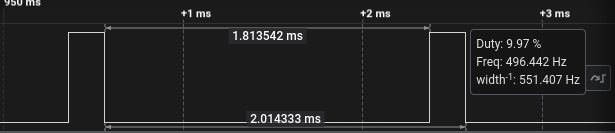
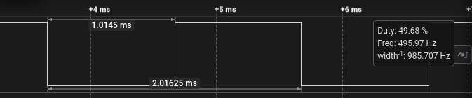
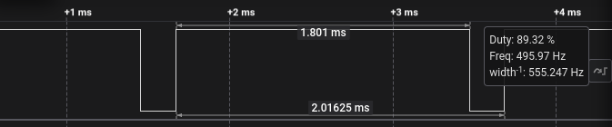

# Task 3 – Evidence of Execution

**Platform:** VSDSquadron Mini (CH32V003 RISC-V)

---

## UART Evidence

### Serial Terminal Configuration

| Parameter | Value |
|----------|-------|
| Tool | VS Code Serial Monitor |
| Baud Rate | 9600 |
| Data Bits | 8 |
| Stop Bits | 1 |
| Parity | None |

---

## Hardware Evidence – PWM Signal Verification (Logic Analyzer)

To prove that the duty cycle is changing correctly, the output on **PD3** was captured using a **Logic Analyzer**.

### 1. Duty Cycle: 10%

Observation:  
<center>
  
</center>

---

### 2. Duty Cycle: 50%

Observation:  

<center>
  
</center>

---

### 3. Duty Cycle: 90%

Observation:  

<center>
  
</center>

---

## Explanation

The demo application uses the custom **PWM Driver Library (`pwm.c`)** to generate signals and the **UART Driver (`uart.c`)** for control.

### Workflow

#### 1. Initialization
```c
PWM_Init(GPIOD, 3, 2000);
PWM_Start();
```
- Configures Pin **PD3** with a **2000 µs period (500 Hz)**  
- Enables signal generation  

#### 2. Signal Generation
- The main loop calls `PWM_Update()` continuously.  
- This function checks the internal timer and toggles PD3 HIGH/LOW based on the calculated on-time.

#### 3. User Interaction
- `uart_receive_char()` captures user input without blocking signal generation.  
- When a number is entered, `PWM_Set_Duty(val)` updates the library's internal state.  
- The next call to `PWM_Update()` immediately uses the new duty cycle.

---

## Verification Summary

This evidence confirms that:

- The PWM Driver Library correctly generates accurate duty cycles (verified via Logic Analyzer).  
- The UART Interface allows real-time control without interrupting the signal.  
- Start/Stop functionality works as intended.  
- The firmware runs successfully on the VSDSquadron Mini hardware.

---

## Final Summary

All **Task-3 evidence requirements** have been satisfied:

- UART Logs Verified  
- Hardware Action (LED Control) Verified  
- Logic Analyzer Proof Verified  
- Library & Application Separation Verified  